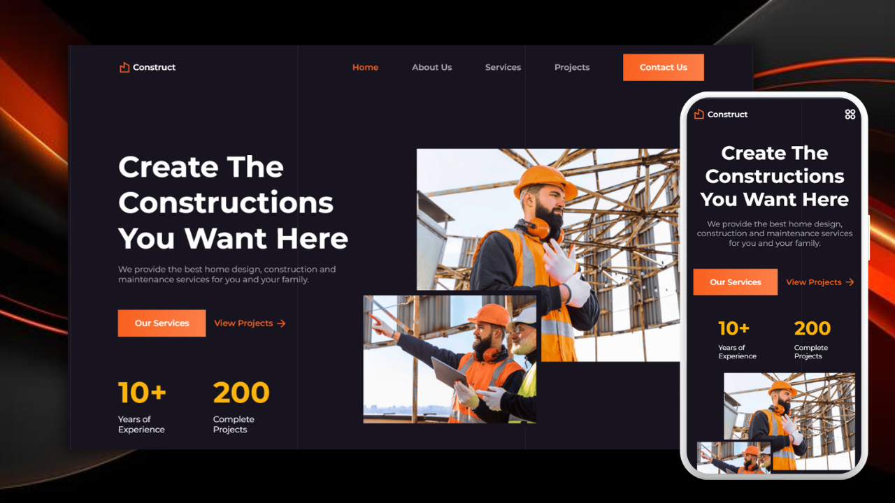

# Responsive Construction Website

A responsive construction website developed using HTML, CSS, and JavaScript, providing a smooth and efficient user experience across all devices. The design features a modern, intuitive interface with scroll animations, making it visually appealing and interactive.

## Key Features

- **Fully Responsive Design**: Optimized for both mobile and desktop, ensuring a seamless and consistent user experience.
- **Scroll Animations**: Eye-catching animations that trigger as you scroll through different sections.
- **Smooth Scrolling**: Effortless navigation between sections with smooth scrolling effects.
- **Mobile-First Approach**: Developed using the mobile-first methodology, ensuring the best performance on smaller screens before scaling up to larger devices.
- **Cross-Device Compatibility**: Fully compatible with all mobile devices, offering a clean and user-friendly interface on every screen size.

## Preview

[Live Demo](https://webiste-construction.netlify.app/)
